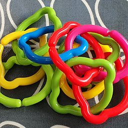

# etc2_encode
Realtime rgba8 -> etc2 (etc1 subset only) encoder as a compute shader

**Original**

**ETC1 Mode**

PSNR: 27.0509
Total time: 0.00008 ms

**ETC2 Mode**

PSNR: 29.2100
Total time: 0.11946 ms

**ASTC Fast AABB 1P Mode**

PSNR: 26.6621
Total time: 0.00035 ms

**ASTC Full 1P Mode**

PSNR: 32.2536
Total time: 0.09977 ms

**ASTC Full 2P Mode**

PSNR: 34.831
Total time: 0.21391 ms
